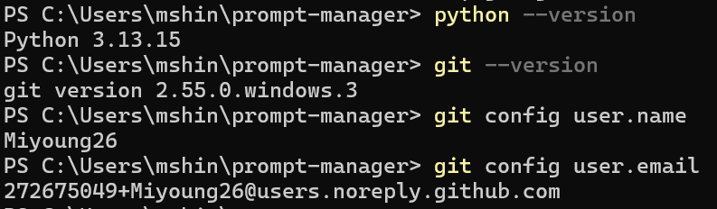
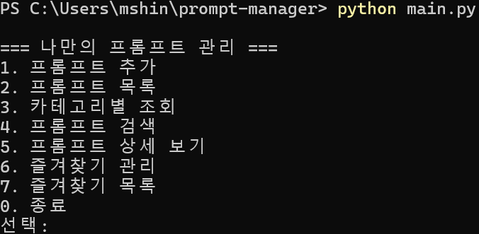
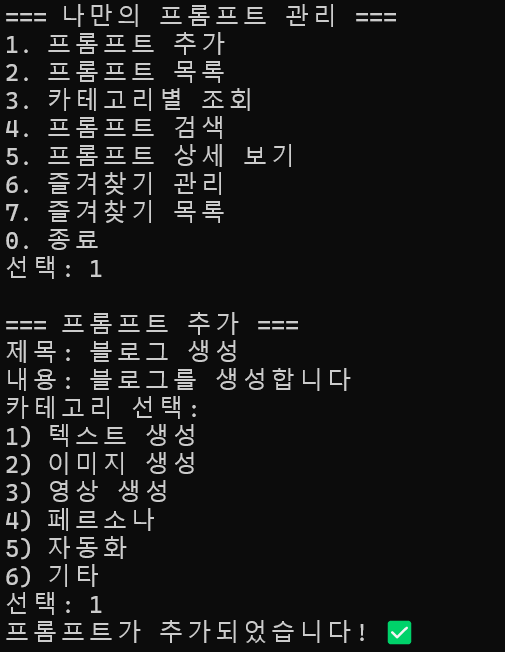
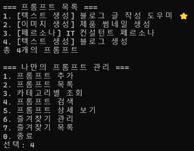
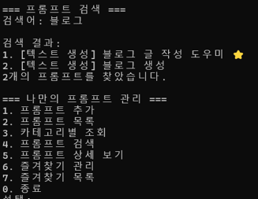
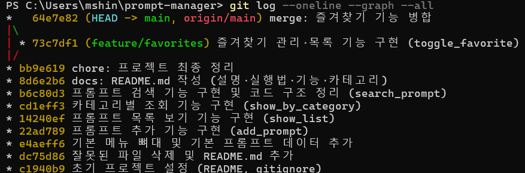

# 나만의 프롬프트 관리 (Prompt Manager)

터미널에서 실행하는 콘솔 기반 프롬프트 관리 프로그램입니다.
GenAI 미션에서 만든 프롬프트를 카테고리별로 정리하고,
검색·즐겨찾기 기능으로 편하게 관리할 수 있습니다.

## 실행 방법

```bash
python main.py
```

- Python 3.10 이상 필요
- 외부 라이브러리 없이 기본 문법만 사용

## 기능 목록

| 번호 | 기능 | 설명 |
|:---:|------|------|
| 1 | 프롬프트 추가 | 제목·내용·카테고리를 입력해 새 프롬프트 등록 |
| 2 | 프롬프트 목록 | 등록된 모든 프롬프트를 번호와 함께 표시 |
| 3 | 카테고리별 조회 | 선택한 카테고리의 프롬프트만 출력 |
| 4 | 프롬프트 검색 | 제목·내용에서 키워드로 검색 |
| 5 | 프롬프트 상세 보기 | 선택한 프롬프트의 전체 내용 표시 |
| 6 | 즐겨찾기 관리 | 즐겨찾기 추가/해제 (토글) |
| 7 | 즐겨찾기 목록 | 즐겨찾기된 프롬프트만 모아보기 |
| 0 | 종료 | 프로그램 종료 |

> ⚠️ 추가한 프롬프트와 즐겨찾기 상태는 프로그램 실행 중에만 유지되며,
> 종료 시 초기화됩니다.

## 프롬프트 카테고리

| 카테고리 | 설명 |
|----------|------|
| 텍스트 생성 | 블로그·이메일 등 글쓰기용 프롬프트 |
| 이미지 생성 | 썸네일·일러스트 등 이미지 생성용 |
| 영상 생성 | 광고·스크립트 등 영상 제작용 |
| 페르소나 | 특정 전문가 역할 설정용 |
| 자동화 | 반복 작업·업무 자동화용 |
| 기타 | 위 분류에 없는 프롬프트 |

## 개발 정보

- 언어: Python 3.10+
- 버전 관리: Git & GitHub
- 데이터 구조: 리스트 + 딕셔너리

## 📸 개발 환경



## 🖥️ 실행 화면

### 메인 메뉴


### 프롬프트 추가


### 프롬프트 목록


### 프롬프트 검색


## 🌳 Git 커밋 그래프

